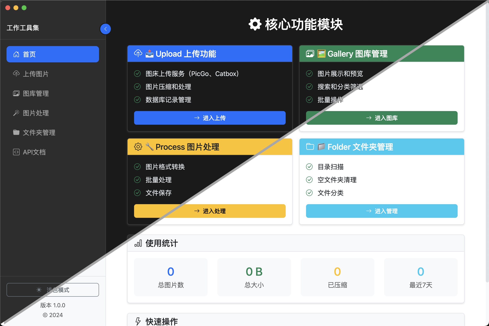
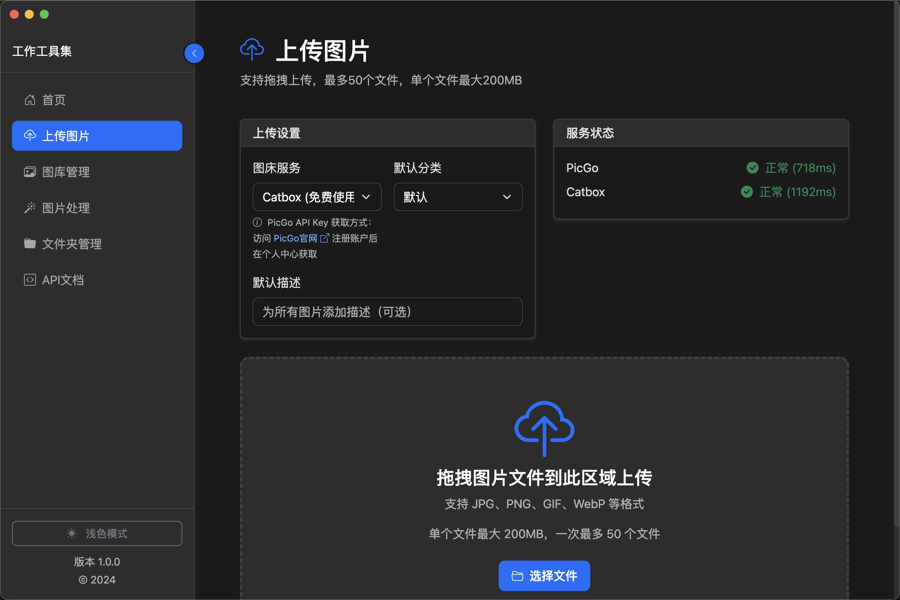
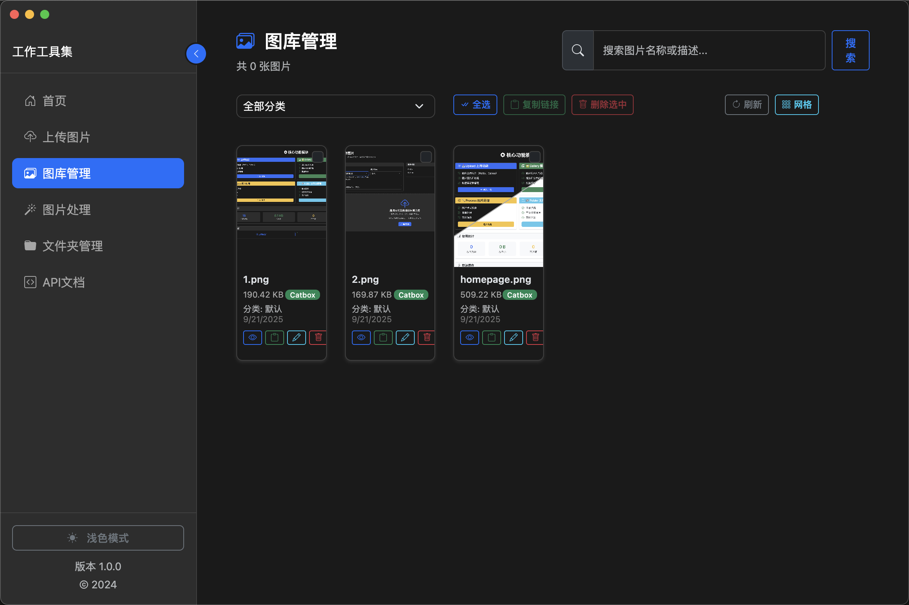
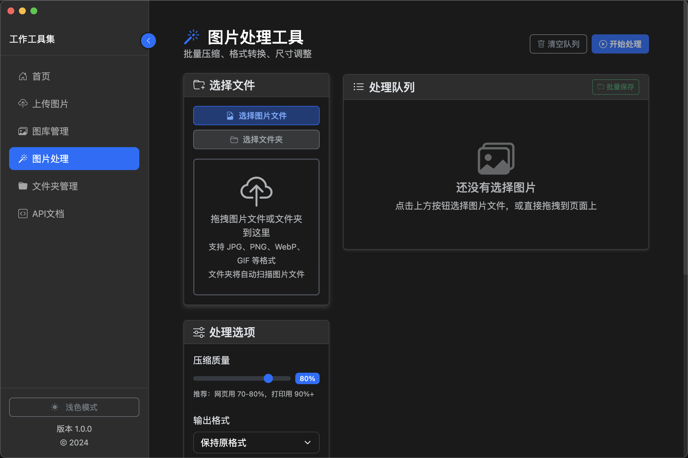
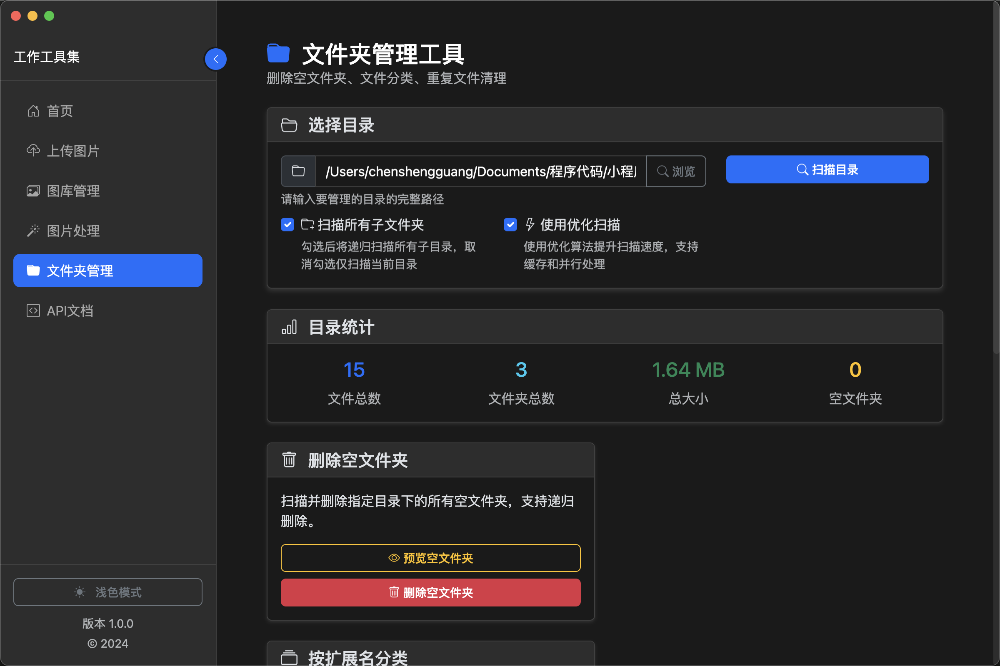

# 🧰 多功能工具箱 - 开箱即用的桌面应用

[](https://opensource.org/licenses/MIT)
[](https://nodejs.org/)
[](https://electronjs.org/)

基于 **Node.js + EJS + Electron** 技术栈的现代化多功能工具箱，集成图片上传、图库管理、图片处理、AI 智能重命名、智能整理文件夹等核心功能。**开箱即用**，支持通过脚本快速扩展新功能模块。

## 🌟 项目特色

- **🚀 开箱即用** - 无需复杂配置，下载即可运行
- **🔧 快速扩展** - 通过 `create-tool.sh` 脚本一键创建新功能模块
- **📱 现代化界面** - 基于 Bootstrap 5 的响应式设计
- **⚡ 高性能** - Electron 桌面应用，本地运行更流畅
- **🔌 插件化架构** - 模块化设计，功能独立可扩展
- **🤖 AI 智能化** - 集成多种 AI 模型，提供智能重命名和文件整理
- **🌍 跨平台** - 支持 web、 macOS、Windows 和 Linux

## 📸 界面预览

### 🏠 首页 - 功能模块总览


### 📤 上传功能 - 拖拽上传界面


### 🖼️ 图库管理 - 图片浏览界面


### 🔧 图片处理 - 批量处理界面


### 📁 智能整理文件夹 - AI 驱动的文件管理界面


### 🤖 AI 智能重命名 - 基于内容分析的重命名界面


## 🎯 核心功能模块分析

### 📤 Upload 上传功能
- **图床上传服务** - 支持 PicGo、Catbox 等多个图床平台
- **图片压缩和处理** - 智能压缩超大文件，确保上传成功
- **数据库记录管理** - 完整的上传历史和元数据管理
- **拖拽上传支持** - 现代化的文件上传体验
- **批量处理能力** - 一次性处理多个文件
- **🔐 安全的API Key管理** - 前端输入，浏览器本地存储，避免泄露

### 🖼️ Gallery 图库管理
- **图片展示和预览** - 响应式网格布局，支持大图预览
- **搜索和分类筛选** - 强大的搜索引擎和分类系统
- **批量操作** - 支持批量选择、复制链接、删除等操作
- **元数据管理** - 完整的图片信息和标签系统
- **快速导航** - 高效的图片浏览和管理体验

### 🔧 Process 图片处理
- **图片格式转换** - 支持主流图片格式之间的转换
- **批量处理** - 一键处理多个文件，提高工作效率
- **文件保存** - 灵活的输出选项和保存位置设置
- **质量控制** - 精确的压缩参数和质量调节
- **预览功能** - 处理前后对比预览

### 📁 Folder 智能整理文件夹
- **智能文件分类** - AI 驱动的文件自动分类，支持按类型、时间、大小、混合等多种策略
- **文件夹清理工具** - 智能识别和清理空文件夹、重复文件，释放存储空间
- **目录深度扫描** - 递归扫描文件夹结构，提供详细的内容统计和分析
- **预览模式** - 所有操作支持预览功能，确保安全执行
- **批量操作** - 支持批量移动、复制、删除等操作，提高工作效率
- **详细统计分析** - 生成完整的目录使用情况报告和文件类型分布

### 🤖 Rename AI 智能重命名
- **AI 内容分析** - 基于文档内容和语义理解的智能重命名
- **多模型支持** - 集成对话模型（Qwen、DeepSeek等）和视觉模型，适应不同文件类型
- **OCR 文字识别** - 图片文件支持 OCR + 视觉模型组合，提高识别准确度
- **多服务商智能重试** - 配置多个 AI 服务商，遇到限制时自动切换
- **并发处理** - 支持多文件并发处理，显著提升处理速度
- **智能保留原名** - 自动识别已有明确含义的文件名并保持不变
- **自定义命名模板** - 支持语义、日期+内容、分类+名称等多种命名策略

## 🚀 快速开始

### 📋 环境要求
- **Node.js** >= 16.0.0
- **npm** >= 8.0.0
- **操作系统** - Windows 10+, macOS 10.14+, Linux

### ⚡ 一键启动
```bash
# 1. 克隆项目
git clone https://github.com/yourusername/multi-tool-desktop.git
cd multi-tool-desktop

# 2. 安装依赖
npm install

# 3. 启动应用
npm run electron
```

### 🌐 Web 模式运行
```bash
# 启动 Web 服务器
npm run dev

# 访问地址
http://localhost:3000
```

## 🔧 快速扩展新功能

### 🛠️ 使用 create-tool.sh 脚本

本项目最大的特色是支持**一键创建新功能模块**，无需手动编写大量模板代码：

```bash
# 交互式创建新工具
./create-tool.sh

# 或直接指定操作
./create-tool.sh create
```

### 📝 创建流程演示

1. **运行脚本**
   ```bash
   $ ./create-tool.sh create
   🛠️  工具创建向导
   ==================
   ```

2. **输入工具信息**
   ```
   请输入工具的中文名称（如：开发工具）: 文档转换器
   请输入工具的英文名称（如：devtools）: docconverter
   ```

3. **选择图标和模板**
   ```
   常用图标选择：
   1. bi-tools (工具)    2. bi-code-slash (代码)
   3. bi-file-text (文本) 4. bi-calculator (计算器)
   ...
   请选择图标 (1-9，默认为1): 3

   📄 页面模板选择：
   1. 通用模板 - 简洁的基础模板，适合快速开发
   2. 增强版模板 - 包含完整文件处理功能的模板
   请选择模板类型 (1-2，默认为2): 2
   ```

4. **自动生成文件**
   ```
   🚀 开始创建工具...
   ✅ 创建路由文件: routes/docconverter.js
   ✅ 创建服务文件: services/docconverterService.js
   ✅ 创建视图文件: views/docconverter.ejs
   ✅ 创建前端脚本: public/js/docconverter.js
   ✅ 更新应用路由: app.js
   ✅ 更新侧边栏导航: views/partials/sidebar.ejs

   🎉 工具创建成功！
   ```

### 🎯 生成的文件结构

脚本会自动创建完整的功能模块：

```
新工具模块/
├── routes/docconverter.js          # 路由控制器
├── services/docconverterService.js # 业务逻辑服务
├── views/docconverter.ejs          # 页面模板
├── public/js/docconverter.js       # 前端交互脚本
├── app.js                          # 自动注册路由
└── views/partials/sidebar.ejs     # 自动添加导航项
```

### ✨ 模板特性对比

| 特性 | 通用模板 | 增强版模板 |
|------|----------|------------|
| **开发时间** | 5-10分钟定制 | 开箱即用 |
| **页面复杂度** | 中等 (~182行) | 功能完整 (~226行) |
| **文件处理** | 基础支持 | 完整的拖拽上传 |
| **进度显示** | 状态指示器 | 实时进度条 |
| **Electron集成** | 基础检测 | 完整IPC支持 |
| **适用场景** | 简单工具 | 文件处理工具 |

## 🛠️ 技术栈

### 🖥️ 桌面应用
- **Electron** 38.1.2 - 跨平台桌面应用框架
- **Node.js** 16+ - JavaScript 运行时环境

### 🌐 Web 技术
- **Express.js** - 轻量级 Web 应用框架
- **EJS** - 高效的 JavaScript 模板引擎
- **Bootstrap 5** - 现代化 UI 组件库
- **Vanilla JavaScript** - 原生 JS，无框架依赖

### 💾 数据存储
- **SQLite3** - 轻量级关系型数据库
- **Sharp** - 高性能图片处理库
- **Multer** - 文件上传中间件

### 🔒 安全特性
- **Helmet** - HTTP 安全头设置
- **CORS** - 跨域资源共享控制
- **Rate Limiting** - API 请求频率限制

## 📁 项目架构

```
multi-tool-desktop/
├── 🚀 核心文件
│   ├── app.js                    # Express 应用入口
│   ├── electron-main.js          # Electron 主进程
│   ├── package.json              # 项目配置
│   └── create-tool.sh            # 工具创建脚本 ⭐
│
├── 📄 页面模板 (views/)
│   ├── layout.ejs                # 主布局模板
│   ├── index.ejs                 # 首页
│   ├── upload.ejs                # 上传功能页
│   ├── gallery.ejs               # 图库管理页
│   ├── process.ejs               # 图片处理页
│   ├── folder.ejs                # 智能整理文件夹页
│   ├── rename.ejs                # AI 智能重命名页
│   └── partials/
│       └── sidebar.ejs           # 侧边栏组件
│
├── 🛣️ 路由控制 (routes/)
│   ├── index.js                  # 首页路由
│   ├── upload.js                 # 上传功能路由
│   ├── gallery.js                # 图库管理路由
│   ├── process.js                # 图片处理路由
│   ├── folder.js                 # 智能整理文件夹路由
│   ├── rename.js                 # AI 智能重命名路由
│   └── api.js                    # API 接口路由
│
├── ⚙️ 业务服务 (services/)
│   ├── uploadService.js          # 图床上传服务
│   ├── imageService.js           # 图片处理服务
│   ├── folderService.js          # 智能整理文件夹服务
│   ├── renameService.js          # AI 智能重命名服务
│   ├── databaseService.js        # 数据库服务
│   └── imageProcessService.js    # 图片处理服务
│
├── 🎨 前端资源 (public/)
│   ├── css/custom.css            # 自定义样式
│   ├── js/
│   │   ├── upload.js             # 上传功能脚本
│   │   ├── gallery.js            # 图库管理脚本
│   │   ├── process.js            # 图片处理脚本
│   │   ├── folder.js             # 智能整理文件夹脚本
│   │   ├── rename.js             # AI 智能重命名脚本
│   │   ├── theme.js              # 主题切换
│   │   └── utils.js              # 通用工具
│   └── uploads/                  # 文件上传目录
│
├── 🔧 工具脚本 (scripts/)
│   └── create-tool.js            # 工具创建核心脚本
│
├── 📊 数据模型 (models/)
│   └── ImageRecord.js            # 图片记录模型
│
└── 📚 文档 (docs/)
    ├── screenshots/              # 界面截图
    ├── CREATE_TOOL_GUIDE.md      # 工具创建指南
    └── ELECTRON_GUIDE.md         # Electron 开发指南
```

## 📖 使用指南

### 🏠 首页导航
- 访问首页查看所有功能模块
- 点击各功能卡片的"进入"按钮快速跳转
- 支持深色/浅色主题切换

### 📤 上传功能使用
1. 点击"进入上传"或访问 `/upload`
2. 选择图床服务（PicGo 或 Catbox）
3. **如选择PicGo**：输入API Key（首次输入后自动保存到浏览器本地）
4. 拖拽或选择图片文件
5. 设置分类和描述信息
6. 点击"开始上传"

> **🔐 API Key 安全说明**：PicGo API Key 仅保存在您的浏览器本地存储中，不会上传到服务器或GitHub，确保您的密钥安全。

### 🖼️ 图库管理使用
1. 点击"进入图库"或访问 `/gallery`
2. 使用搜索框查找特定图片
3. 使用分类筛选器过滤内容
4. 点击图片预览大图和详细信息
5. 支持批量选择和操作

### 🔧 图片处理使用
1. 点击"进入处理"或访问 `/process`
2. 选择要处理的图片文件
3. 设置转换格式和质量参数
4. 选择输出目录
5. 开始批量处理

### 📁 智能整理文件夹使用
1. 点击"进入管理"或访问 `/folder`
2. 选择要扫描的目录，支持包含子文件夹选项
3. 查看详细的文件统计信息和类型分布
4. **智能文件分类**：选择分类策略（按类型/时间/大小/混合），预览后执行分类
5. **文件夹清理**：删除空文件夹、清理重复文件，释放存储空间
6. **详细统计**：获取完整的目录分析报告

### 🤖 AI 智能重命名使用
1. 点击"进入重命名"或访问 `/rename`
2. **选择文件夹**：拖拽或选择包含需要重命名文件的文件夹
3. **AI 配置**：
   - 单一服务商模式：选择推荐的 AI 模型（如 Qwen3-Next-80B）
   - 多服务商模式：配置模型优先级，支持智能重试
4. **重命名配置**：
   - 选择命名模板（语义/日期+内容/分类+名称/自定义）
   - 设置自定义提示词优化重命名效果
   - 启用 OCR 文字识别（图片文件）
   - 配置并发处理级别提升速度
5. **执行重命名**：预览建议名称后批量应用或单独处理

> **🤖 AI 功能说明**：
> - **对话模型**：适用于文档、代码等文本文件的内容分析
> - **视觉模型**：专门处理图片文件，支持图像内容理解
> - **OCR 增强**：图片文件可同时使用 OCR 和视觉模型，提高准确度
> - **智能重试**：多服务商模式下遇到 API 限制自动切换到备用模型

## 🎨 自定义开发

### 🔧 修改现有功能
每个功能模块都有清晰的文件结构，便于定制：

```bash
# 修改页面样式
views/功能名.ejs          # 页面模板和布局

# 修改业务逻辑
services/功能名Service.js  # 后端业务处理

# 修改前端交互
public/js/功能名.js       # 前端JavaScript逻辑

# 修改路由规则
routes/功能名.js          # 路由和API接口
```

### 🎯 添加新的图床服务
在 `services/uploadService.js` 中扩展：

```javascript
class NewImageHostProvider extends UploadProvider {
  constructor() {
    super("新图床名称");
    this.apiUrl = "https://api.example.com/upload";
    this.maxFileSize = 50 * 1024 * 1024; // 50MB
  }

  async upload(file, options) {
    // 实现上传逻辑
  }
}
```

### 🎨 自定义主题
修改 `public/css/custom.css` 中的 CSS 变量：

```css
:root {
  --primary-color: #your-color;
  --secondary-color: #your-color;
  --background-color: #your-color;
}
```

## 📊 API 接口文档

### 🖼️ 图片管理 API
```http
GET    /api/images           # 获取图片列表
GET    /api/images/:id       # 获取单个图片信息
DELETE /api/images           # 批量删除图片
PUT    /api/images/:id       # 更新图片信息
```

### 📤 上传相关 API
```http
POST   /upload/files         # 上传图片文件
GET    /upload/services/status # 获取服务状态
POST   /upload/services/switch # 切换上传服务
```

### 📊 统计分析 API
```http
GET    /api/stats            # 获取使用统计
GET    /api/categories       # 获取分类列表
GET    /api/search           # 搜索图片
```

### 📁 智能整理文件夹 API
```http
POST   /folder/scan          # 扫描目录
POST   /folder/classify      # 智能文件分类
POST   /folder/clean         # 清理空文件夹
POST   /folder/duplicates    # 重复文件处理
GET    /folder/stats         # 获取目录统计
```

### 🤖 AI 智能重命名 API
```http
POST   /rename/analyze       # AI 文件内容分析
POST   /rename/suggest       # 生成重命名建议
POST   /rename/apply         # 应用重命名
POST   /rename/batch         # 批量重命名处理
GET    /rename/models        # 获取可用 AI 模型
POST   /rename/ocr           # OCR 文字识别
```

## 🚀 部署指南

### 📦 打包桌面应用
```bash
# 打包所有平台
npm run build

# 打包 macOS
npm run build-mac

# 打包 Windows
npm run build-win

# 打包 Linux
npm run build-linux
```

### 🌐 Web 服务部署
```bash
# 使用 PM2 部署
npm install -g pm2
pm2 start app.js --name "multi-tool"

# 使用 Docker 部署
docker build -t multi-tool .
docker run -p 3000:3000 multi-tool
```

## 🤝 贡献指南

我们欢迎所有形式的贡献！无论是新功能、Bug 修复、文档改进还是使用反馈。

### 🔄 贡献流程
1. **Fork** 本项目到你的 GitHub 账户
2. **Clone** 你的 Fork 到本地开发环境
3. **创建分支** `git checkout -b feature/amazing-feature`
4. **开发功能** 编写代码并测试
5. **提交更改** `git commit -m 'Add amazing feature'`
6. **推送分支** `git push origin feature/amazing-feature`
7. **创建 PR** 在 GitHub 上创建 Pull Request

### 🐛 问题反馈
- 使用 [GitHub Issues](https://github.com/yourusername/multi-tool-desktop/issues) 报告 Bug
- 提供详细的复现步骤和环境信息
- 附上相关的错误日志和截图

### 💡 功能建议
- 在 Issues 中使用 `enhancement` 标签
- 详细描述功能需求和使用场景
- 欢迎提供设计稿或原型图

## 📄 开源协议

本项目采用 **MIT License** 开源协议。

```
MIT License

Copyright (c) 2024 Multi-Tool Desktop

Permission is hereby granted, free of charge, to any person obtaining a copy
of this software and associated documentation files (the "Software"), to deal
in the Software without restriction, including without limitation the rights
to use, copy, modify, merge, publish, distribute, sublicense, and/or sell
copies of the Software, and to permit persons to whom the Software is
furnished to do so, subject to the following conditions:

The above copyright notice and this permission notice shall be included in all
copies or substantial portions of the Software.
```

## 🌟 项目亮点

### 🚀 开箱即用
- **零配置启动** - 下载即可运行，无需复杂环境配置
- **完整功能** - 四大核心模块覆盖常见使用场景
- **现代界面** - 基于 Bootstrap 5 的美观界面

### 🔧 高度可扩展
- **脚本化创建** - `create-tool.sh` 一键生成新功能模块
- **模块化架构** - 清晰的代码结构，易于维护和扩展
- **插件化设计** - 支持自定义图床服务和处理器

### ⚡ 性能优异
- **本地运行** - Electron 桌面应用，响应速度快
- **智能处理** - 自动压缩和格式转换
- **批量操作** - 支持大量文件的批量处理

### 🛡️ 安全可靠
- **本地存储** - 数据完全保存在本地，隐私安全
- **API Key 保护** - 敏感信息仅存储在浏览器本地，不上传到代码仓库
- **文件验证** - 严格的文件类型和安全检查
- **错误处理** - 完善的异常处理和用户提示

## 📝 版本更新

### 🎉 v1.2.0 (2024-12-25)
- 🆕 **AI 智能重命名** - 基于多种 AI 模型的智能文件重命名功能
- 🆕 **智能整理文件夹** - AI 驱动的文件分类和清理工具
- 🆕 **多服务商支持** - 集成 Qwen、DeepSeek、豆包等多个 AI 服务商
- 🆕 **OCR 文字识别** - 图片文件支持 OCR + 视觉模型组合处理
- 🆕 **并发处理** - 支持多文件并发处理，显著提升处理速度
- 🆕 **智能重试机制** - 多服务商模式下的自动切换和容错处理

### 🎉 v1.0.0 (2024-12-21)
- ✅ **四大核心模块** - Upload、Gallery、Process、Folder 功能完整
- ✅ **工具创建脚本** - `create-tool.sh` 支持一键创建新功能
- ✅ **Electron 桌面应用** - 跨平台桌面应用支持
- ✅ **现代化界面** - Bootstrap 5 响应式设计
- ✅ **插件化架构** - 模块化设计，易于扩展
- ✅ **完整文档** - 详细的使用和开发文档

### 🔮 计划中的功能
- 🤖 更多 AI 模型集成（GPT-4、Claude 等）
- 📱 移动端适配优化
- 🌐 更多图床服务支持
- 🎨 主题商店和自定义主题
- 📊 AI 驱动的智能数据分析
- 🔄 自动更新机制
- 🗣️ 语音识别和语音命名

## 🔗 相关资源

### 📚 官方文档
- [Express.js 官方文档](https://expressjs.com/) - Web 应用框架
- [EJS 模板引擎](https://ejs.co/) - 服务端模板
- [Electron 官方文档](https://electronjs.org/) - 桌面应用框架
- [Bootstrap 5 文档](https://getbootstrap.com/) - UI 组件库

### 🛠️ 开发工具
- [Sharp 图片处理](https://sharp.pixelplumbing.com/) - 高性能图片处理
- [SQLite 数据库](https://www.sqlite.org/) - 轻量级数据库
- [Node.js 官网](https://nodejs.org/) - JavaScript 运行时

### 🎯 相似项目
- [PicGo](https://github.com/Molunerfinn/PicGo) - 图片上传工具
- [uPic](https://github.com/gee1k/uPic) - macOS 图片上传工具
- [Typora](https://typora.io/) - Markdown 编辑器

---

<div align="center">

### 🌟 如果这个项目对你有帮助，请给个 Star ⭐

**开发状态**: 🚀 持续开发中
**技术栈**: Node.js + Express + EJS + Electron + Bootstrap
**开发理念**: 开箱即用 + 快速扩展 + 现代化体验

[⬆️ 回到顶部](#-多功能工具箱---开箱即用的桌面应用)

</div>
